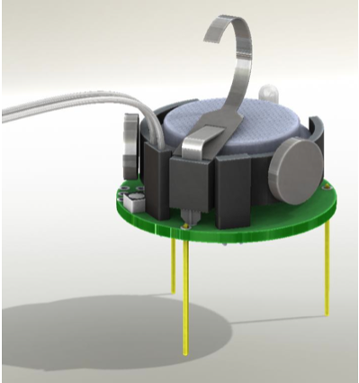

# Use the debug features

---

Sometimes the code can produce some unexpected behaviors. To help to find out the causes, kilobots are equipped with a very basic debugging feature.

---

## How to set up the debug feature

### Step 1 : Include `debug.h`

In the first lines of your program, add the following lines :

```c
#define DEBUG
#include <debug.h>
```

### Step 2 : Initialize the debugger

In the main function of your program, add the following line between `kilo_init()` and `kilo_start()` :

```c
kilo_init();
debug_init();  // This line is new
kilo_start(setup, loop);
```

### Step 3 : Add `printf()`s

Debugging code on kilobots is actually just using the common C function `printf()` to send a `string` to the head controller and therefore the computer. You can use it to trace the execution of your program or to check the value of a variable.

```c
printf("%d", kilo_ticks);  // Example printing the value of kilo_ticks
```

### Step 4 : Connect the kilobot to the head controller

That's where the two pins located on the left side of the kilobot's front leg come in to play. Connect those pins to the pins of the head controller like presented in these images :




!!! Note
    On some head controller, the 2 debug pins are located *under* the board. The white end of the connector cable needs to connect to the head, and the black end will connect to the kilobot.

### Step 5 : Open the Serial Input window

After you transfer your compiled program to the kilobot, open the serial input window by clicking the `Serial Input` button. There you will see every message sent by the kilobot via the `printf()` function.

We are done !

---

## A complete example

Here is a basic "Hello world!" program to test the debugging feature. You can download the source file [here](../resources/sources/testDebug.c).

```c
#include <kilolib.h>
#define DEBUG
#include <debug.h>

void setup() {
    printf("Hello world!");
}

void loop() { return; }

int main() {
    kilo_init();
    debug_init();
    kilo_start(setup, loop);
    return 0;
}
```
