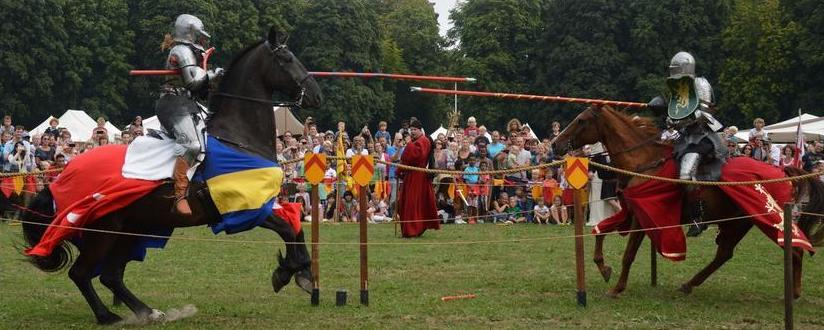

# King-o-bot's Games

[*source code of this tutorial*](../resources/sources/knight.c)

---

## Summary

By now you should have mastered the movement and communication abilities of kilobots. However, there is one last sensing ability you have yet to discover : distance sensing.

Kilobots can evaluate their distance from another kilobot when they receive a message : that's the purpose of the `message_rx()` function's second argument.

In this simple tutorial, we are going to put two kilobots one in front of the other. As medieval knights, they will charge the other. However, the kilobots are really fearful and, when they will reach their personal distance limit, they will freak out and give up.



---

## What you will learn

* How to evaluate distance with the `distance_measurement_t` argument and `estimate_distance()`
* More complex state management

---

## Knight's program

### Defining macros and global variables

To make our program more configurable and readable, we are going to use *C macros*. The first two macros are used to define boundaries for the kilobot's distance limit. The four following macros define the kilobot's state.

```c
#define MIN_DISTANCE 35
#define MAX_DISTANCE 70

#define CHARGING 0
#define FREAKING_OUT 1
#define WON 2
#define LOST 3
```

Our program will also use 3 global variables. One will contain the kilobot's distance limit, the second contains its state and the last one is used for storing messages.

```c
int distanceLimit;
int state;
message_t message;
```

### The `setup()` function

Here we define the kilobot's custom distance limit using `rand_hard()`. We set the initial *state* : at the beginning, the two kilobots are *charging*. When communicating, the kilobot will send its state in `data`, so that the other kilobot know when its opponent freaks out. Finally, we set the color to an aggressive red and make the kilobot run forward.

```c
void setup() {
    // Set the distance limit.
    distanceLimit = (rand_hard() % (MAX_DISTANCE - MIN_DISTANCE)) + MIN_DISTANCE;

    // Set the state
    state = CHARGING;

    // Set the message
    message.type = NORMAL;
    message.data[0] = state;
    message.crc = message_crc(&message);

    // Set light and movement
    set_color(RGB(3, 0, 0));
    spinup_motors();
    set_motors(kilo_straight_left, kilo_straight_right);
}
```

!!!note
    We defined `MIN_DISTANCE` and `MAX_DISTANCE` to be 35 and 70 millimeters respectively. This means that `distanceLimit` will always be between those two values.

### Communications

Now **this** is the big part of this tutorial.

The `message_tx()` function is quite classic know :

```c
message_t* message_tx() {
    return &message;
}
```

The `message_rx()` function however, is where the magic happens. Here, we analyse the state of the opponent and its distance from us. If the opponent is still charging and is closer than our distance limit, we start to freak out and surrender. If the opponent is freaking out on the other hand, we win and stop moving.

```c
void message_rx(message_t *m, distance_measurement_t *d) {
    if (state == CHARGING && m->data[0] == CHARGING) {
        // The kilobot and his opponent are still charging each other
        if (estimate_distance(d) < distanceLimit) {
            // The kilobot freaks out and surrender
            state = FREAKING_OUT;

            // Change message
            message.data[0] = state;
            message.crc = message_crc(&message);

            // Change movement
            spinup_motors();
            set_motors(0, kilo_turn_right);
        }
    }
    else if (m->data[0]) {
        // The oponnent is freaking out
        state = WON;

        // Stop charging
        spinup_motors();
        set_motors(0, 0);
    }
}
```

Here you can see how measuring distance is easy. We only need to pass the second argument of `message_rx()` to `estimate_distance()`. The result is an approximation of the distance between the two kilobots in millimeters. It can be stored as an `int` and compared with the `distanceLimit` we have defined earlier.

### The `loop()` function

The `loop()` function will take care of the kilobot's shown behavior depending on its state.

```c
void loop() {
    if (state == CHARGING) {
        // The kilobot is charging : blink red
        set_color(RGB(3, 0, 0));
        delay(100);
        set_color(RGB(0, 0, 0));
        delay(100);
    }
    else if (state == FREAKING_OUT) {
        // The kilobot is freaking out : quickly blink white for 2 seconds
        for (int i = 0 ; i < 2000 ; i += 200) {
            set_color(RGB(3, 3, 3));
            delay(100);
            set_color(RGB(0, 0, 0));
            delay(100);
        }
        // The kilobot is calming down, he lost
        set_motors(0, 0);
        state = LOST;
    }
    else if (state == WON) {
        // The kilobot won the fight : blink blue, green and yellow
        set_color(RGB(0, 0, 3));
        delay(100);
        set_color(RGB(0, 3, 0));
        delay(100);
        set_color(RGB(3, 3, 0));
        delay(100);
    }
    else {
        // The kilobot lost the fight : slowly, shamefully blinks white
        set_color(RGB(1, 1, 1));
        delay(2000);
        set_color(RGB(0, 0, 0));
        delay(2000);
    }
}
```

### Put it all together

Once again, nothing new in the `main()` function :

```c
int main()
{
    kilo_init();

    kilo_message_tx = message_tx;
    kilo_message_rx = message_rx;

    kilo_start(setup, loop);

    return 0;
}
``` 

---

## We are done !

You can now make *impressive* and *quite shocking* kilobots duels ! Place them in front of each other, start and watch them charge... until one freaks out.

You have mastered distance sensing and are now ready to code some complex programs for kilobots. It's now time to implement *collective behaviors* with a bigger number of kilobots.

---
