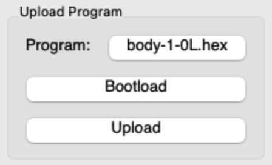
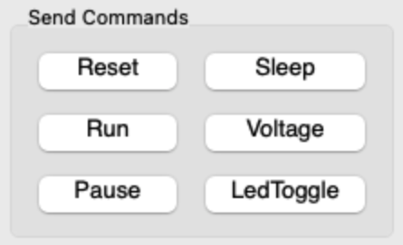

# Transfer and run your programs

---

## Transfer a program to your kilobots

Once you have successfully compiled your program, it's time to transfer it! To do so, we are going to use this part of the KiloGUI interface :

Use the `[select file]` button to select the `.hex` file you will transfer into the kilobots. Here, we selected the `body-1-OL.hex` file. Be sure that KiloGUI is connected to the kilobots by hitting the `Bootload` button. The kilobots' LEDs should now be blue. You can then click the `Upload` button to start the transfer. The kilobots will blink green and blue alternatively during this process. Wait a few seconds. When the program has been transferred, the kilobots will get back to blink green slowly, indicating that they are ready to start the execution !

!!!warning
    If a kilobot only blinks blue and green for a short amount of time before turning off during transfer, a problem has occurred. Ensure your code does not contain syntaxical errors (if so, they should be displayed during compilation). Be sure the voltage of the kilobot is not too low (aka not red). Check that the ground on which the kilobot is placed is reflecting enough for IR communication. If none of these solutions work, try updating the kilobot firmware.

!!!note
    If you experience trouble as above, consider trying different programs, kilobots and reflecting surfaces to identify the root of the problem.

---

## Run the program

If the program transfer was successful, it's now time to start the execution! For this section, we are going to focus on this part of the KiloGUI interface :

To start the execution, just press the `Run` button. The `Pause` button will stop the execution until the `Run` button is hit again. To make the kilobots go back to the starting point of the program, use the `Reset` button.

The other buttons are not really linked to the program execution. `Sleep` will put the kilobots to sleep, `Voltage` will display the battery level using the kilobots' LEDs and `LedToggle` can be used to ensure that the connection between the kilobots and the head controller has been well established.

---
