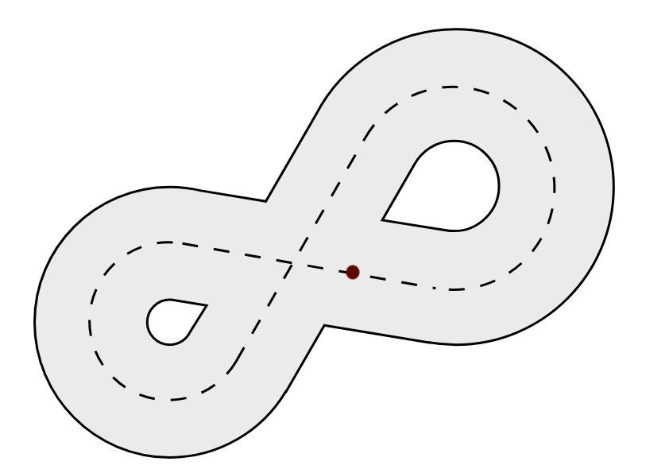

# Race around the world

[*source code of this tutorial*](../resources/sources/race.c)

---

## Summary

In this tutorial, we are going to discover the basics of kilobot programming. This simple bunch of code will make a single kilobot race along a track in loop.

The code in this tutorial is written for [this racetrack](../resources/images/RaceTrack.png). The kilobot starts the race with its front leg on the red point. Note that you can adapt it to any race track you want.



!!! Note
    We suggest you draw the racetrack onto the kilobot table using a whiteboard marker, so as to not make the robot run on a harsh surface.

---

## What you will learn

* Basic template for a kilobot program
* How to make the kilobot flash color with `set_color()`
* How to make the kilobot move with `set_motors()`

---

## Basics

If you have already read the [coding for kilobots](../guides/coding-for-kilobots.md) guide, you already know that a kilobot program is divided in two main parts : the `setup()` function and the `loop()` function. The `setup()` function is only executed once, at the very start of the execution, and the `loop()` function is executed again and again until the kilobot is told to stop.

The following sections will illustrate how these two components work to build a simple behavior for the kilobot.

---

## The `setup()` function

Before the kilobot starts racing along the track, we are going to make it flash like the flashlight at the beginning of a real race. As this code is only ran once at the start, we are going to place it in the `setup()` function :

```c
void setup() {
    // Blinks red, yellow and green before startup
    set_color(RGB(1,0,0));  // red
    delay(1000);
    set_color(RGB(1,1,0));  // yellow
    delay(1000);
    set_color(RGB(0,1,0));  // green
}
```

!!! Note
    The `delay()` function stops the execution of the program, but it doesn't stop the LED from shining. It is useful to turn the LED on for a certain amount of time.

---

## The `loop()` function

The sequence of actions that a kilobot must do to race a single loop around the track will be placed here.

```c
void loop() {
    // Goes straight
    spinup_motors();
    set_motors(kilo_straight_left, kilo_straight_right);
    delay(2000);

    // Turns left
    spinup_motors();
    set_motors(kilo_turn_left, kilo_straight_right/2);
    delay(5000);

    // Goes straight again
    spinup_motors();
    set_motors(kilo_straight_left, kilo_straight_right);
    delay(4000);

    // Turns right
    spinup_motors();
    set_motors(kilo_straight_left/2, kilo_turn_right);
    delay(5000);

    // Goes straight to get back to the race starting point
    spinup_motors();
    set_motors(kilo_straight_left, kilo_straight_right);
    delay(2000);
}
```

To make the kilobot move, we use the `set_motors()` function. Before calling it, we must call the `spinup_motors()` function to avoid [static friction](https://en.wikipedia.org/wiki/Friction#Static_friction) effects.

The two arguments of the `set_motors()` function indicate the power of each motor of the kilobot. Those values can go from 0 (off) to 255 (full speed). To take calibration into account, it is recommended to use the predefined values `kilo_straight_left`, `kilo_straight_right`, `kilo_turn_left` and `kilo_turn_right` rather than some raw numbers.

!!! Note
    Just as it did for the LED, the `delay()` function makes it possible to define the amount of time during which the motors must work. It doesn't stop the movement of the kilobot

!!! Note
    See how we used `kilo_straight_left/2` and `kilo_straight_right/2` when turning. This enables us to manage the angle of turn. The more we divide the value, the tighter the turn becomes. Replacing those expressions by `0` would give the tightest turns.

!!! Warning
    Kilobots movement depends on a lot of factors and is impredictable by nature. The values used in the `delay()` or `set_motors()` functions might be changed for them to work in your particular environment.

---

## The `main()` function

We are almost done ! At this point, we only have to define the entry-point of our program : the `main()` function.

```c
int main() {
    // Initializes hardware
    kilo_init();
    // Starts program
    kilo_start(setup, loop);

    return 0;
}
```

The `main()` function must always call `kilo_init()`, then `kilo_start()` in order to start the program.

---

## We are done !

You can now admire your kilobot burn the tarmac ! Well, it might not be that impressive. The kilobots were probably not designed as racing machines. But fair enough, it at least made you learn the basics of programming for kilobots !

---
